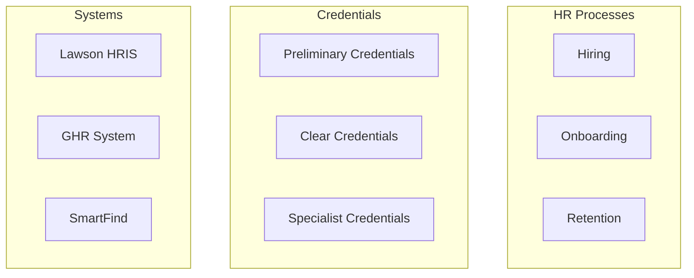
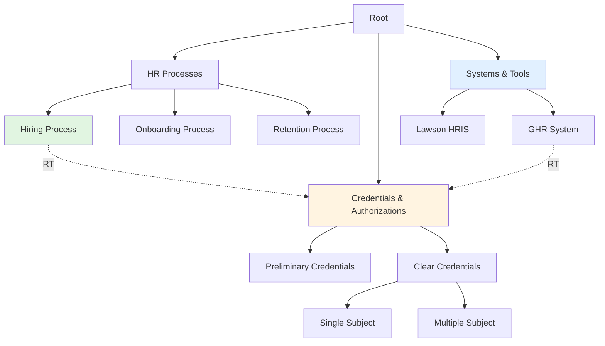

# Taxonomy Design Workflow

## Overview

This skill provides a systematic workflow for creating formal, standards-compliant taxonomies following ANSI/NISO Z39.19 guidelines. The workflow progresses from domain analysis through term extraction, hierarchy design, relationship mapping, and final validation, ensuring taxonomies are well-structured, maintainable, and fit for purpose.

## When to Use This Skill

Deploy this skill when:
- Creating a new tag taxonomy for an Obsidian vault
- Designing classification systems for documentation or knowledge bases
- Building controlled vocabularies for enterprise systems
- Structuring faceted taxonomies with multiple dimensions
- Migrating from unstructured to structured classification

## Workflow Decision Tree

```
Start: User needs a taxonomy
    ↓
Is this a new taxonomy from scratch?
    │
    ├─ YES → Follow full workflow (Steps 1-7)
    │
    └─ NO → Is this refining an existing taxonomy?
           │
           ├─ YES → Start at Step 5 (Validation)
           │
           └─ NO → Is this migrating flat tags to hierarchy?
                  └─ Use tag-taxonomy-migration skill instead
```

## Step 1: Domain Analysis & Scope Definition

Define the taxonomy's purpose, scope, and success criteria before term extraction.

### 1.1 Clarify Purpose and Use Cases

Ask the user:
- **Primary purpose**: What will this taxonomy organize? (notes, documents, processes, entities)
- **User needs**: Who will use this taxonomy and for what tasks?
- **Success criteria**: What makes this taxonomy successful?

### 1.2 Define Scope Boundaries

Establish clear boundaries:
- **Included concepts**: Which topics/domains are in scope?
- **Excluded concepts**: Which topics are explicitly out of scope?
- **Depth target**: How many hierarchy levels are appropriate? (ANSI/NISO recommends 5-6 optimal, warns at 7+)

### 1.3 Identify Facet Dimensions

For multi-dimensional classification, identify facets:
- **Common facets**: Department, Process, System, Document Type, Status, Time Period, Location
- **Domain-specific facets**: Industry-specific classifications
- **User confirmation**: Which facets apply to this domain?

**Output**: Clear scope statement and list of facet dimensions (if applicable)

---

## Step 2: Term Extraction from Existing Content

Extract candidate terms from existing content to ground taxonomy in actual usage patterns.

### 2.1 Analyze Existing Content

Use the `scripts/analyze_vault_terms.py` script to extract terms:

```bash
python scripts/analyze_vault_terms.py <vault-path> --output candidate_terms.csv
```

The script extracts:
- Existing tags (if Obsidian vault)
- Heading text from markdown files
- Frequently occurring noun phrases
- File and folder names

### 2.2 Review and Filter Candidate Terms

Review the extracted terms with the user:
- **Keep**: Terms that represent distinct concepts within scope
- **Remove**: Duplicates, synonyms, out-of-scope terms, overly specific instances
- **Consolidate**: Merge similar terms (e.g., "credential", "credentials" → "Credentials")

### 2.3 Identify Preferred and Alternative Labels

For each term, establish:
- **Preferred label (prefLabel)**: The canonical term to use
- **Alternative labels (altLabel)**: Synonyms and variants
- **Scope notes**: Usage guidance if needed

**Example**:
```
prefLabel: "Teacher Credentials"
altLabel: ["credentials", "certifications", "teaching licenses"]
scopeNote: "Formal authorizations from CTC (California Commission on Teacher Credentialing)"
```

**Output**: Refined list of candidate terms with preferred/alternative labels

---

## Step 3: Concept Clustering and Initial Grouping

Group related terms into natural clusters to inform hierarchy design.

### 3.1 Apply Clustering Heuristics

Group terms by:
- **Domain similarity**: Terms describing the same domain area
- **Part-whole relationships**: Terms where one is part of another
- **Process steps**: Terms representing sequential activities
- **Temporal relationships**: Terms with time-based connections

### 3.2 Generate Cluster Visualization

Create a Mermaid diagram showing initial clusters:



### 3.3 Validate Clusters with User

Present clusters and ask:
- Do these groupings make sense?
- Are any terms misplaced?
- Are any natural groupings missing?

**Output**: Validated concept clusters

---

## Step 4: Hierarchy Design and Relationship Mapping

Build the hierarchical taxonomy structure with broader/narrower/related relationships.

### 4.1 Establish Top-Level Concepts

Identify 3-7 top-level categories:
- Represent major facets or domain areas
- Mutually exclusive at top level (avoid overlap)
- Cover the full scope of the taxonomy

**Example (FUSD HR Taxonomy)**:
```
Root
├── HR Processes
├── Credentials & Authorizations
├── Systems & Tools
├── Departments
├── Document Types
└── Employee Lifecycle
```

### 4.2 Build Hierarchical Relationships (BT/NT)

For each top-level concept, create narrower terms (NT):

**Broader Term (BT) / Narrower Term (NT) Rules**:
- **NT must be a type of BT**: "Clear Credential" is a type of "Credential"
- **Avoid instance relationships**: Use classes, not individual instances
- **Test with "is a kind of"**: Does "X is a kind of Y" make sense?

**Example**:
```
Credentials & Authorizations (BT)
    ├── Preliminary Credentials (NT)
    ├── Clear Credentials (NT)
    │   ├── Single Subject Teaching Credential (NT)
    │   └── Multiple Subject Teaching Credential (NT)
    └── Specialist Credentials (NT)
```

### 4.3 Add Associative Relationships (RT)

Identify related terms (RT) that are connected but not hierarchical:

**Related Term (RT) Rules**:
- **Cross-facet connections**: Terms from different branches that often co-occur
- **Process dependencies**: Steps that depend on each other
- **Complementary concepts**: Terms that are often referenced together

**Example**:
```
"Credential Verification" RT "Talent Acquisition"
"GHR System" RT "Credential Management"
"Hiring Process" RT "Onboarding Process"
```

### 4.4 Support Polyhierarchy (Multiple Parents) if Needed

Allow concepts to have multiple broader terms when appropriate:

**Example**:
```
"BCLAD Authorization" (Bilingual Cross-cultural Language Development)
    BT: "Language Authorizations"
    BT: "Subject Matter Authorizations"
```

### 4.5 Generate Hierarchy Visualization

Create comprehensive Mermaid diagram:



**Output**: Complete taxonomy hierarchy with BT/NT/RT relationships

---

## Step 5: ANSI/NISO Z39.19 Compliance Validation

Validate taxonomy against ANSI/NISO Z39.19 standards using `references/ansi-niso-guidelines.md`.

### 5.1 Check Structural Rules

Validate:
- ✓ Single root concept or small number of top-level concepts (3-7 recommended)
- ✓ Depth within recommended range (5-6 levels optimal, warning at 7+)
- ✓ Balanced tree (no single branch much deeper than others)
- ✓ Consistent granularity at each level
- ✓ No orphaned concepts (except root and leaves)
- ✓ No circular references

### 5.2 Check Relationship Rules

Validate:
- ✓ BT/NT relationships are reciprocal
- ✓ "Is a kind of" test passes for all BT/NT pairs
- ✓ RT relationships are symmetric
- ✓ No mixing of relationship types (e.g., "part-of" disguised as "is a")

### 5.3 Check Term Quality

Validate:
- ✓ Preferred labels are clear and unambiguous
- ✓ Alternative labels captured for synonyms
- ✓ Scope notes provided where needed
- ✓ Consistent terminology (singular vs plural, capitalization)
- ✓ No jargon without definition

### 5.4 Generate Validation Report

Create report using `assets/validation-report-template.md`:

```markdown
# Taxonomy Validation Report

**Taxonomy**: [Name]
**Date**: [Date]
**Validator**: [Name]

## Summary
- Total concepts: [N]
- Max depth: [N] levels
- Top-level concepts: [N]
- Issues found: [N]

## Issues
1. [Issue description] - Severity: [Critical/High/Medium/Low]
   - Location: [Path to concept]
   - Recommendation: [Fix suggestion]

## Compliance
- ✓ ANSI/NISO Z39.19 structural rules: PASS/FAIL
- ✓ Relationship consistency: PASS/FAIL
- ✓ Term quality: PASS/FAIL
```

**Output**: Validation report with issues and recommendations

---

## Step 6: Taxonomy Documentation

Generate comprehensive documentation using `assets/taxonomy-template.md`.

### 6.1 Create Taxonomy Specification

Document:
- **Purpose and scope**: What the taxonomy organizes and why
- **Facet definitions**: Description of each facet dimension
- **Hierarchy diagram**: Mermaid visualization of complete structure
- **Term definitions**: Preferred label, alternative labels, scope notes for each concept
- **Relationship index**: List of all RT relationships
- **Usage guidelines**: How to apply the taxonomy

### 6.2 Generate Implementation Artifacts

Create deliverables:
- **Markdown documentation**: Human-readable taxonomy guide
- **CSV export**: Machine-readable format (ID, prefLabel, altLabel, BT, NT, RT)
- **SKOS export** (optional): RDF/Turtle format for semantic web tools
- **Tag mapping** (for Obsidian): Old tags → New taxonomy terms

**Example CSV**:
```csv
ID,prefLabel,altLabel,BT,NT,RT,definition
CRED-001,Credentials,,ROOT,CRED-PREL|CRED-CLEAR,,Formal authorizations
CRED-PREL,Preliminary Credential,Prelim,CRED-001,,"HIRE-001",Initial teaching credential
```

### 6.3 Create Change Log

Document taxonomy evolution:
- **Version**: 1.0
- **Date**: [Date]
- **Changes**: Initial taxonomy creation
- **Author**: [Name]

**Output**: Complete taxonomy documentation package

---

## Step 7: Deployment Planning

Plan rollout strategy for applying the taxonomy.

### 7.1 Migration Strategy

For existing content:
- **Mapping table**: Old tags/terms → New taxonomy terms
- **Migration script**: Automated tag replacement (for Obsidian vaults)
- **Manual review list**: Edge cases requiring human judgment
- **Rollback plan**: How to revert if needed

### 7.2 Governance Process

Establish:
- **Taxonomy owner**: Who maintains the taxonomy?
- **Change request process**: How are new terms requested?
- **Review schedule**: How often is taxonomy reviewed?
- **Version control**: How are changes tracked?

### 7.3 User Training

Create:
- **Quick reference guide**: 1-page taxonomy overview
- **Usage examples**: How to tag common scenarios
- **FAQs**: Common questions and answers

**Output**: Deployment plan with migration strategy and governance

---

## Resources

### scripts/

**`analyze_vault_terms.py`** - Extract candidate terms from Obsidian vault or markdown files:
```bash
python scripts/analyze_vault_terms.py <vault-path> --output candidate_terms.csv --min-frequency 2
```

Extracts:
- Existing tags (YAML frontmatter and inline)
- Heading text (H1-H3)
- Frequently occurring noun phrases
- File and folder names

Output: CSV with term, frequency, source files

### references/

**`ansi-niso-guidelines.md`** - Key principles from ANSI/NISO Z39.19 standard:
- Structural requirements
- Relationship rules
- Term quality guidelines
- Depth recommendations

**`taxonomy-patterns.md`** - Common taxonomy patterns:
- Enumerative taxonomy (simple hierarchy)
- Faceted taxonomy (multi-dimensional)
- Polyhierarchical taxonomy (multiple parents)
- Network taxonomy (rich relationships)

### assets/

**`taxonomy-template.md`** - Documentation template for final taxonomy
**`validation-report-template.md`** - Template for validation reports

---

## Quick Reference: Relationship Types

| Type | Abbr | Meaning | Example |
|------|------|---------|---------|
| Broader Term | BT | Parent concept | "Credential" is BT of "Clear Credential" |
| Narrower Term | NT | Child concept | "Clear Credential" is NT of "Credential" |
| Related Term | RT | Associated concept | "Credential Verification" RT "Hiring Process" |
| Preferred Label | PL | Canonical term | "Credentials" (not "creds", "certifications") |
| Alternative Label | AL | Synonym/variant | "Certifications" is AL for "Credentials" |

---

## Best Practices

1. **Start simple, refine iteratively** - Begin with 3-5 top-level concepts and expand
2. **Ground in actual content** - Extract terms from real documents, don't theorize
3. **Test with users early** - Validate clusters and hierarchies before finalizing
4. **Enforce "is a kind of" rule** - Keep hierarchies clean and logical
5. **Document rationale** - Capture why certain design decisions were made
6. **Plan for evolution** - Taxonomies grow; design for change
7. **Balance depth vs breadth** - 5-6 levels deep, 5-9 children per node (Miller's Law)

---

## Common Pitfalls to Avoid

❌ **Mixing relationship types** - Don't use BT/NT for part-whole (use separate relationship)
❌ **Too deep too fast** - Don't exceed 7 levels without strong justification
❌ **Overly specific leaves** - Avoid turning instances into taxonomy terms
❌ **Inconsistent granularity** - Keep similar levels of specificity at each depth
❌ **Orphaned branches** - Ensure all concepts connect to root
❌ **Circular references** - A cannot be BT of B if B is BT of A

---

**Workflow Complete**: Taxonomy designed, validated, documented, and ready for deployment.
