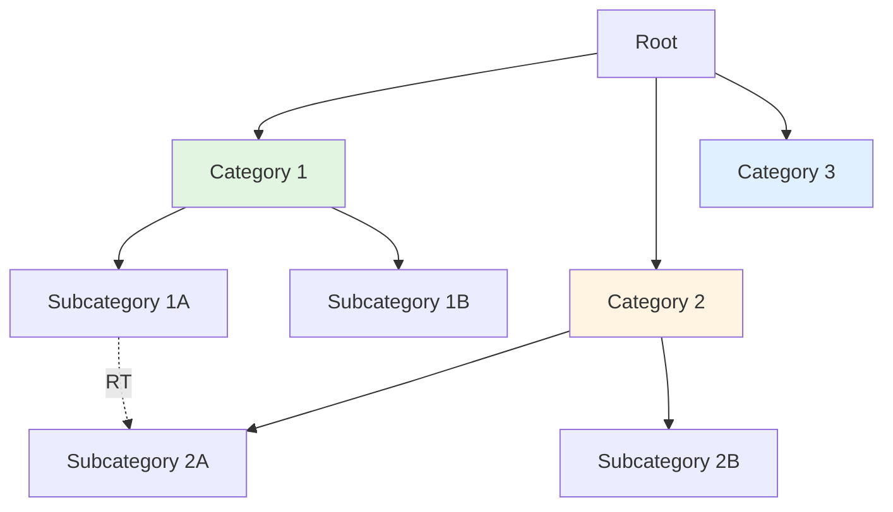

# [Taxonomy Name] - Specification

**Version**: 1.0
**Date**: [Date]
**Author**: [Name]
**Status**: [Draft/Final/Deprecated]

---

## Purpose and Scope

**Purpose**: [What does this taxonomy organize and why?]

**Scope**:
- **Included**: [Which concepts/domains are in scope?]
- **Excluded**: [Which concepts are explicitly out of scope?]

**Success Criteria**: [What makes this taxonomy successful?]

---

## Facet Definitions

[If faceted taxonomy, define each facet dimension]

### Facet 1: [Facet Name]
**Definition**: [What this facet represents]
**Values**: [List of possible values or reference to hierarchy]

### Facet 2: [Facet Name]
**Definition**: [What this facet represents]
**Values**: [List of possible values or reference to hierarchy]

---

## Hierarchy Diagram

---

## Term Definitions

### [Term ID]: [Preferred Label]

- **Alternative Labels**: [Synonyms, variants]
- **Broader Term**: [Parent term ID and label]
- **Narrower Terms**: [Child term IDs and labels]
- **Related Terms**: [Associated term IDs and labels]
- **Definition**: [Clear definition of this term]
- **Scope Note**: [Usage guidance, examples]
- **Examples**: [Example usage in context]

---

## Relationship Index

### Related Term (RT) Relationships

| Term 1 | Term 2 | Rationale |
|--------|--------|-----------|
| [Term] | [Term] | [Why these terms are related] |

---

## Usage Guidelines

### When to Use This Taxonomy
[Scenarios where this taxonomy should be applied]

### How to Apply Terms
[Instructions for tagging/classifying content]

### Common Scenarios

**Scenario 1**: [Description]
- **Recommended terms**: [Which terms to use]
- **Example**: [Concrete example]

**Scenario 2**: [Description]
- **Recommended terms**: [Which terms to use]
- **Example**: [Concrete example]

---

## Governance

**Taxonomy Owner**: [Person/Team responsible for maintenance]

**Change Request Process**:
1. [Step 1]
2. [Step 2]
3. [Step 3]

**Review Schedule**: [How often is taxonomy reviewed?]

**Version Control**: [Where is taxonomy source of truth?]

---

## Change Log

| Version | Date | Author | Changes |
|---------|------|--------|---------|
| 1.0 | [Date] | [Name] | Initial taxonomy creation |

---

## Appendix: Complete Term List

[Full alphabetical list of all terms with IDs for quick reference]

| ID | Preferred Label | Alternative Labels | Broader Term |
|----|-----------------|-------------------|--------------|
| [ID] | [Label] | [Alts] | [BT] |
