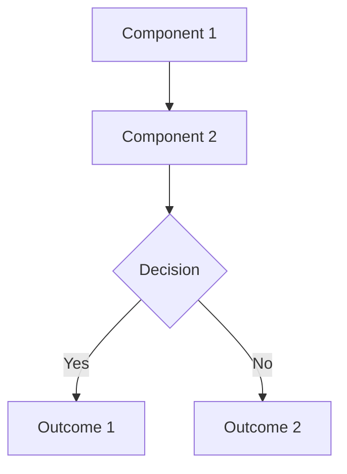

# Word Diagram Formatter

## When to Use This Skill

Use this skill when:
- User reports ASCII diagrams don't render well in Microsoft Word
- Converting technical documentation for vendor RFPs or professional presentations
- User needs diagrams in Word-compatible formats
- System architecture, flowcharts, or process diagrams need reformatting

**DO NOT use for**:
- Obsidian-only documentation (Mermaid diagrams work great there)
- Internal technical docs where ASCII is acceptable
- Documents that will never be exported to Word/PDF

---

## Core Workflow: Present Options Before Converting

**CRITICAL RULE**: ALWAYS present format options to the user before performing any conversion.

### Step 1: Identify the Problem

When user reports diagram rendering issues:
1. Read the document to identify ASCII diagrams
2. Note which sections contain diagrams (architecture, workflows, process flows)
3. Count total diagrams requiring conversion

### Step 2: Generate Format Options Document

Create a comparison document showing 4 alternative formats:

**Option 1: Structured Tables**
- Clean tables showing layers, components, and relationships
- Word compatibility: ⭐⭐⭐⭐⭐ Excellent
- Visual appeal: ⭐⭐⭐ Good
- Best for: Production RFP documents, executive presentations

**Option 2: Bullet Hierarchy**
- Indented bullets showing flow and relationships
- Word compatibility: ⭐⭐⭐⭐⭐ Excellent
- Visual appeal: ⭐⭐⭐ Good
- Best for: Technical documentation, process guides

**Option 3: Mermaid Diagrams**
- Visual flowcharts (requires export to PNG/SVG for Word)
- Word compatibility: ⭐⭐ Poor (requires manual export)
- Visual appeal: ⭐⭐⭐⭐⭐ Excellent
- Best for: Obsidian-first workflow with occasional Word exports

**Option 4: Combination Approach**
- Mix of tables + prose + note to convert to Visio/Lucidchart
- Word compatibility: ⭐⭐⭐⭐ Very Good
- Visual appeal: ⭐⭐⭐⭐ Very Good
- Best for: Flexible approach with future diagram tool migration

### Step 3: Show Examples

For EACH option, provide:
1. Full example of how the diagram would look
2. Specific conversion of one actual diagram from their document
3. Pros and cons for their use case

**Format for Options Document**:
```markdown
# Diagram Format Options for Word Compatibility

## Option 1: Structured Tables
[Full example showing tables]

## Option 2: Bullet Hierarchy
[Full example showing bullets]

## Option 3: Mermaid Diagrams
[Full example with export instructions]

## Option 4: Combination Approach
[Full example with mixed format]

## Comparison Summary
[Table comparing all 4 options]

## Recommendation
[Your recommendation based on their document type]
```

### Step 4: Wait for User Selection

**DO NOT PROCEED WITHOUT USER CONFIRMATION**

Ask: "Which format would you like me to use for all diagrams?"

### Step 5: Apply Selected Format

Once user selects a format:
1. Confirm scope: "I'll replace all [X] diagrams with Option [Y] format"
2. Process each diagram systematically
3. Verify no ASCII diagrams remain (using grep)

---

## Format Conversion Patterns

### Option 1: Structured Tables

**Architecture Diagrams** → Convert to layered table:
```markdown
| Layer | Component | Purpose | Key Tables/Procedures |
|-------|-----------|---------|----------------------|
| 1. Entry | [Name] | [Purpose] | [Resources] |
| 2. Config | [Name] | [Purpose] | [Resources] |
```

**Workflow Diagrams** → Convert to step-by-step table:
```markdown
| Step | Stage | Action | Data Source | Outcome |
|------|-------|--------|-------------|---------|
| 1 | [Stage] | [Action] | [Source] | [Result] |
| 2 | [Stage] | [Action] | [Source] | [Result] |
```

### Option 2: Bullet Hierarchy

**Architecture Diagrams** → Convert to nested bullets:
```markdown
1. **LAYER 1: [Name]**
   - Purpose: [Description]
   - Components: [List]

2. **LAYER 2: [Name]**
   - Purpose: [Description]
   - Process:
     - Step 1: [Action]
     - Step 2: [Action]
```

### Option 3: Mermaid Diagrams

**Architecture Diagrams** → Convert to flowchart:
```markdown

```

**Include export instructions**:
```markdown
**How to Export for Word**:
1. View in Obsidian (renders automatically)
2. Right-click → "Copy as PNG"
3. Paste into Word document
```

### Option 4: Combination Approach

**Use tables for structure, prose for flow**:
```markdown
**System Layers**:
| Layer | Component | Purpose |
|-------|-----------|---------|
| 1 | [Name] | [Purpose] |

**Data Flow Description**:
The system follows this workflow:
1. [Step description with context]
2. [Step description with context]

*Note: For visual diagram, convert to Visio before final export.*
```

---

## Verification Protocol

After conversion, ALWAYS verify:

```bash
# Search for remaining ASCII box characters
grep -n "┌\|└\|│\|├\|┐\|┘\|─" document.md

# Search for arrow patterns in indented lines
grep -n "^   " document.md | grep -E "↓|→|├|┌|└"
```

**Expected**: Only intentional hierarchical displays (like tree structures in reference sections)

---

## Example Session

**User**: "The system architecture document doesn't look good in Microsoft Word."

**You**:
```
I'll help you convert the diagrams to Word-compatible formats. Let me first
identify all diagrams in the document and present format options.

[Read document, identify 2 ASCII diagrams in sections 2.1 and Appendix C]

I found 2 ASCII diagrams that need conversion. Let me create a comparison
document showing 4 alternative formats with examples from your actual diagrams.

[Create DIAGRAM_FORMAT_OPTIONS.md with all 4 options]

I've created a comparison document showing 4 format options. Please review:
- Option 1: Structured Tables (best for RFPs)
- Option 2: Bullet Hierarchy (best for technical docs)
- Option 3: Mermaid Diagrams (best for Obsidian-first)
- Option 4: Combination Approach (flexible)

Which format would you like me to use for all diagrams?
```

**User**: "Option 1"

**You**:
```
Perfect! I'll convert all 2 diagrams to structured table format (Option 1).

✅ Section 2.1 - High-Level Architecture → Structured tables
✅ Appendix C - Workflow Diagram → Step-by-step table

[Perform conversions]

Conversion complete! All diagrams now use professional structured tables
that render cleanly in Microsoft Word.
```

---

## Common Diagram Types and Conversions

### System Architecture
**ASCII Pattern**: Boxes with layers
**Best Format**: Option 1 (Layered table) or Option 4 (Table + prose)

### Workflow/Process Flow
**ASCII Pattern**: Sequential steps with arrows
**Best Format**: Option 1 (Step-by-step table) or Option 2 (Bullets)

### Decision Trees
**ASCII Pattern**: Branches with conditions
**Best Format**: Option 3 (Mermaid) or Option 1 (Outcomes table)

### Data Flow
**ASCII Pattern**: Components with directional arrows
**Best Format**: Option 4 (Table + prose description) or Option 3 (Mermaid)

### Hierarchical Structures
**ASCII Pattern**: Tree structure with └─ characters
**Keep as-is**: These render acceptably in Word for reference sections

---

## Quality Checklist

Before marking complete, verify:

- [ ] Created options comparison document
- [ ] Showed examples from actual document
- [ ] Provided recommendation based on document type
- [ ] Waited for user selection
- [ ] Converted ALL diagrams to selected format
- [ ] Verified no ASCII diagrams remain (except intentional hierarchies)
- [ ] Tested that tables render properly in markdown

---

## Anti-Patterns (What NOT to Do)

❌ **DON'T**: Start converting immediately without showing options
❌ **DON'T**: Assume user wants a specific format
❌ **DON'T**: Use Mermaid for documents that MUST export to Word
❌ **DON'T**: Leave ASCII diagrams unconverted after user selects format
❌ **DON'T**: Convert hierarchical reference trees (they're intentional)

✅ **DO**: Always present options with examples
✅ **DO**: Wait for explicit user selection
✅ **DO**: Verify all conversions are complete
✅ **DO**: Match format to document purpose (RFP vs internal doc)

---

## Success Metrics

**Success** = User can open document in Microsoft Word and all diagrams render professionally

**Failure** = Diagrams still show as garbled ASCII or require manual cleanup

---

## Notes for Future Enhancement

- Could add Option 5: PlantUML diagrams (similar to Mermaid)
- Could integrate with diagram generation tools
- Could support batch conversion across multiple documents
- Could auto-detect document type (RFP vs internal) for smart recommendations
